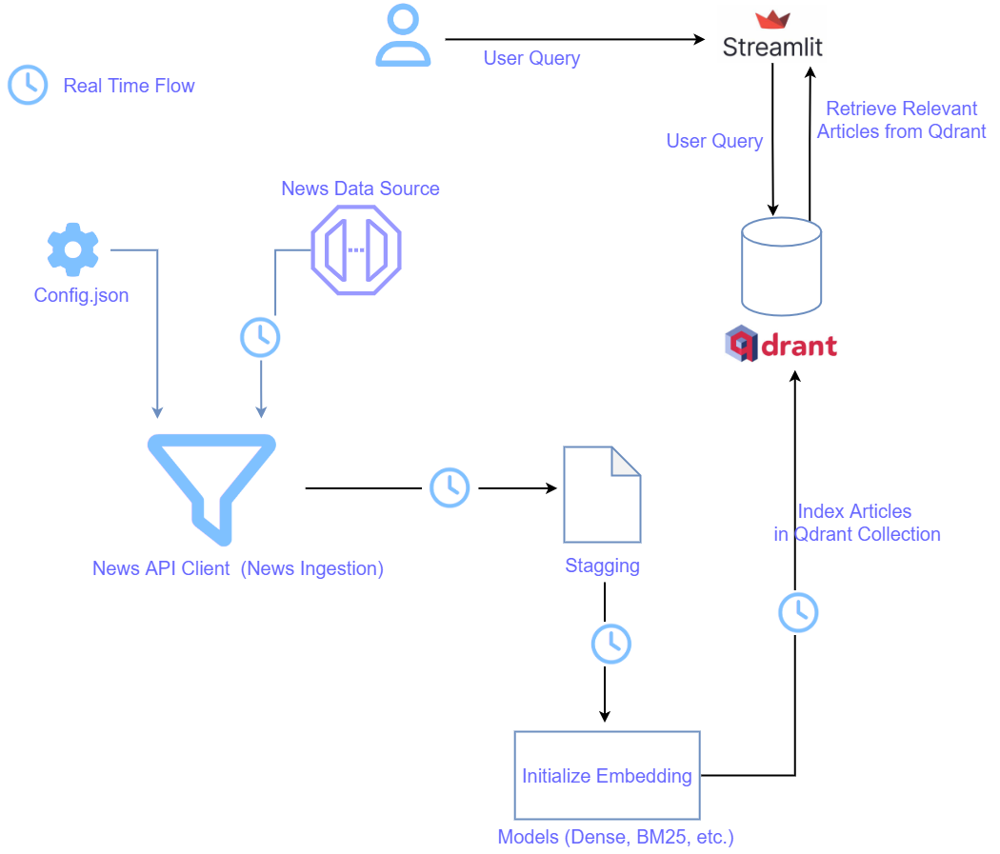

# Real-Time News Search Using Qdrant Query API

## Real-Time News Search: Why It Matters

[Full Article](https://medium.com/@learn-simplified/real-time-news-search-using-qdrant-query-api-9f5a2cc9f8bb)

Staying updated with real-time news is crucial in today's fast-paced world. Whether it's in finance, politics, or crisis management, having access to the latest information can significantly impact decision-making and strategic planning.

In various industries, real-time news plays a vital role:
 - Finance: Investors and financial analysts rely on up-to-the-minute news to make informed decisions about buying or selling stocks. For example, a sudden announcement about a company's earnings can lead to immediate changes in stock prices.
 - Politics: Political analysts and policymakers need real-time updates to understand the shifting dynamics in government policies and international relations. An example is the immediate coverage of election results, which can influence political strategies and public opinion.
 - Crisis Management: During natural disasters or emergencies, real-time news helps organizations and governments respond promptly. For instance, during a hurricane, real-time updates about the storm's path can help in planning evacuations and resource allocation.


## Why Not Keyword-Based Search for News Retrieval

Traditional keyword-based search methods often fall short of retrieving relevant news quickly and accurately. These methods rely on matching exact words or phrases, which can lead to several issues:
 - Relevance: Keyword searches might return results that are not contextually relevant. For example, searching for "Apple" might yield results about both the fruit and the technology company, depending on the context.
 - Speed: In fast-moving situations, the time taken to manually sift through search results can be detrimental. Immediate access to relevant news is crucial, especially in industries like finance and crisis management.


## Architecture



# Tutorial: Setting Up and Running AI Agent Powered Refund Processing System

## Prerequisites
- Python installed on your system.
- A basic understanding of virtual environments and command-line tools.

## Steps

1. **Virtual Environment Setup:**
   - Create a dedicated virtual environment for our project:
   
     ```bash
     python -m venv real_time_news_search_using_qdrant_query_api
     ```
   - Activate the environment:
   
     - Windows:
       ```bash
       real_time_news_search_using_qdrant_query_api\Scripts\activate
       ```
     - Unix/macOS:
       ```bash
       source real_time_news_search_using_qdrant_query_api/bin/activate
       ```

2. **Install Project Dependencies:**

   - Navigate to your project directory and install required packages using `pip`:
   
     ```bash
        
     cd path/to/your/project
     pip install -r requirements.txt
     ```
3. **Setup Qdrant**
  
   For detailed steps, check the [Qdrant_Setup_Guide](https://qdrant.tech/documentation/guides/installation/).
    This guide will walk you through the process of setting up Qdrant using Docker on Windows, which is the easiest way to get started.
    - Step 1: Install Docker
      * Visit the official Docker website: [Docker Installation](https://www.docker.com/products/docker-desktop/).
      * Download Docker Desktop for Windows.
      * Follow the installation wizard to install Docker Desktop.
      * Once installed, start Docker Desktop.

    - Step 2: Verify Docker Installation
      * Open a command prompt or PowerShell.
      * Run the following command to check if Docker is installed correctly
       ```bash
         docker - version
       ```
4. **  Pull the Qdrant Docker Image **
    - In the same command prompt or PowerShell, run:
    ```bash
      docker pull qdrant/qdrant
    ```
    - This will download the latest Qdrant image.
   
5. **Run Qdrant Container**
    - Create a directory for Qdrant data (e.g., C:\qdrant_data).
    - Run the following command to start the Qdrant container:
    ```bash
       docker run -p 6333:6333 -p 6334:6334 -v C:\qdrant_data:/qdrant/storage:z qdrant/qdrant
    ```
    - verify --> http://localhost:6333/dashboard
   

6. **Run - Real-Time News Search Using Qdrant Query API**

   Finally, execute the following command to start the "Real-Time News Search Using Qdrant Query API" application:

   ```bash 
    # Run Real Time Search Using Qdrant
    streamlit run main.py   
   ```


